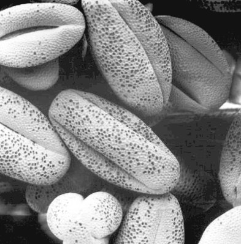

# Histogram Equalization for Image Enhancement

This project focuses on implementing histogram equalization for image enhancement using Python and the Python Imaging Library (PIL). Histogram equalization is a technique used to improve the contrast and brightness of an image by redistributing the intensity levels of its pixels.

## Table of Contents
- [Introduction](#introduction)

- [Histogram Equalization](#HistogramEqualization)
- [Implementation](#Implementation)
- [Usage](#Usage)
- [Demo](#Demo)
- [Conclusion](#Conclusion)

## Introduction
Image enhancement techniques aim to improve the visual quality and information content of digital images. Histogram equalization is one such technique that works by redistributing the pixel intensity levels in an image to cover a wider range of values, thereby enhancing the overall contrast and brightness.

## Histogram Equalization
The histogram of an image represents the distribution of pixel intensities. In a well-contrasted image, the histogram should be spread over a wide range of intensity levels. However, some images may have a narrow histogram, leading to poor contrast and visibility of details.

Histogram equalization transforms the pixel intensities in such a way that the resulting image has a more uniform histogram. This process enhances the visibility of both dark and bright areas, making details more distinguishable.

## Implementation
The implementation of histogram equalization involves the following steps:

1. Histogram Calculation: The histogram of the input image is computed to determine the frequency of each pixel intensity level.

2. Cumulative Distribution Function (CDF): The cumulative distribution function is calculated from the histogram, representing the cumulative sum of the normalized frequencies.

3. Histogram Equalization Mapping: The mapping function is created by normalizing the CDF values to the desired output intensity range (e.g., 0 to 255 for an 8-bit image).

4. Image Transformation: Each pixel in the input image is transformed using the mapping function to obtain the final equalized image.

## Demo
Here is a demo of the histogram equalization applied to an input image:

#### Original image

#### Equalized image

## Conclusion
Histogram equalization is a powerful image enhancement technique that can significantly improve the visibility of details in an image. By redistributing the pixel intensity levels, this method enhances the contrast and brightness of the image, making it more visually appealing and informative. The implementation provided in this project can be used to apply histogram equalization to grayscale images and achieve improved image quality.

